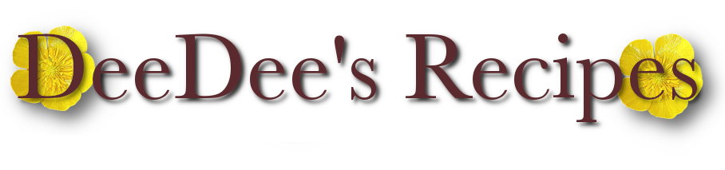

<!--
*** Thanks for checking out the Best-README-Template. If you have a suggestion
*** that would make this better, please fork the repo and create a pull request
*** or simply open an issue with the tag "enhancement".
*** Don't forget to give the project a star!
*** Thanks again! Now go create something AMAZING! :D
-->

<!-- PROJECT SHIELDS -->
<!--
*** I'm using markdown "reference style" links for readability.
*** Reference links are enclosed in brackets [ ] instead of parentheses ( ).
*** See the bottom of this document for the declaration of the reference variables
*** for contributors-url, forks-url, etc. This is an optional, concise syntax you may use.
*** https://www.markdownguide.org/basic-syntax/#reference-style-links
-->

[![LinkedIn][linkedin-shield]][linkedin-url]

<!-- PROJECT LOGO -->
 

  
    
  </a>

<h3 align="center">DeeDee's Recipes</h3>

  

    My grandmother, DeeDee, was notorious for many things, among which were her cooking, and her stories. 
    
DeeDee's Recipes allows users to post and browse through recipes that have a memory or story attatched to them, because every dish has a memory, and every memory deserves a place to tell the story.

  
This is my very first React app and serves as my Nashville Software School front-end capstone project.

     
    <a href="https://github.com/DevDevvy/deedees-recipes-app"><strong>Explore the docs »</strong></a>
     
     
    <a href="https://github.com/DevDevvy/deedees-recipes-app">View Demo</a>
    ·
    <a href="https://github.com/DevDevvy/deedees-recipes-app/issues">Report Bug</a>
    ·
    <a href="https://github.com/DevDevvy/deedees-recipes-app/issues">Request Feature</a>
  

<!-- TABLE OF CONTENTS -->

  
Table of Contents

  <ol>
    <li>
      <a href="#about-the-project">About The Project</a>
      <ul>
        <li><a href="#built-with">Built With</a></li>
      </ul>
    </li>
    <li><a href="#contributing">Contributing</a></li>
    <li><a href="#contact">Contact</a></li>
    <li><a href="#acknowledgments">Acknowledgments</a></li>
  </ol>

<!-- ABOUT THE PROJECT -->
## About The Project
FEATURES:
 <ul>
    <li>Create a new recipe</li>
    <li>Link to a photo of your recipe</li>
    <li>Share your memory of the recipe</li>
    <li>Edit your recipes</li>
    <li>Like/save someone else's recipe</li>
    <li>Comment under any recipe</li>
    <li>Fork someone else's recipe and make changes</li>
    <li>Search by recipe name or ingredient</li>
    <li>Browse a list of all submitted recipes</li>
    
  </ul>

  <a href="https://dbdiagram.io/d/620efde2485e433543d35894">Project ERD</a>

https://user-images.githubusercontent.com/93087995/158285293-2c6cf79c-c4d2-4058-ba79-5b7a66c8a885.mp4

(<a href="#top">back to top</a>)

### Built With

* [React.js](https://reactjs.org/)

 

<!-- CONTRIBUTING -->
## Contributing

Contributions are what make the open source community such an amazing place to learn, inspire, and create. Any contributions you make are **greatly appreciated**.

If you have a suggestion that would make this better, please fork the repo and create a pull request. You can also simply open an issue with the tag "enhancement".
Don't forget to give the project a star! Thanks again!

1. Fork the Project
2. Create your Feature Branch (`git checkout -b feature/AmazingFeature`)
3. Commit your Changes (`git commit -m 'Add some AmazingFeature'`)
4. Push to the Branch (`git push origin feature/AmazingFeature`)
5. Open a Pull Request

(<a href="#top">back to top</a>)

<!-- CONTACT -->
## Contact

Randall- [https://twitter.com/randalltmusic](https://twitter.com/randalltmusic) - thesingingdev@gmail.com

Project Link: [https://github.com/DevDevvy/deedees-recipes-app](https://github.com/DevDevvy/deedees-recipes-app)

(<a href="#top">back to top</a>)

<!-- ACKNOWLEDGMENTS -->
## Acknowledgments

* [Nashville Software School](https://nashvillesoftwareschool.com/) - Special thank you to (Scrum Master) "Coach" Steve, Tyler and Devin
* [AOS Scroll Animations](https://michalsnik.github.io/aos/)
* [React Select](https://react-select.com/home)
* [CSS Tricks Flexbox Guide]()

(<a href="#top">back to top</a>)

<!-- MARKDOWN LINKS & IMAGES -->
<!-- https://www.markdownguide.org/basic-syntax/#reference-style-links -->

[linkedin-shield]: https://img.shields.io/badge/-LinkedIn-black.svg?style=for-the-badge&logo=linkedin&colorB=555
[linkedin-url]: https://linkedin.com/in/randall-thomas-music/
[product-screenshot]: images/screenshot.png
